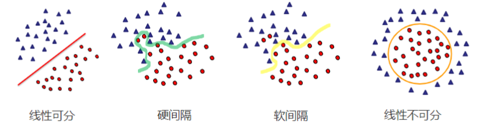
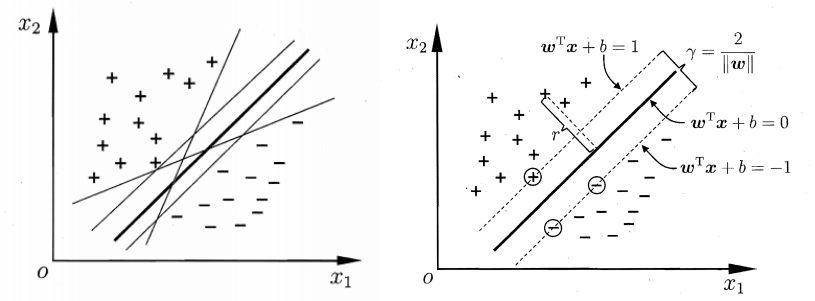
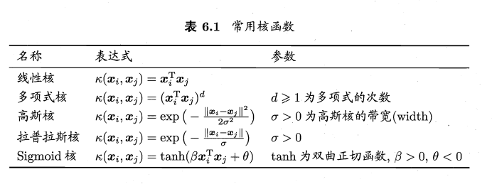
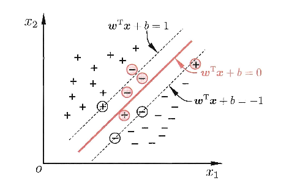

#### SVM

##### 问题分析

只考虑**二分类**问题， 假设有$n$个训练点${x_i \in \mathbb{R}^N}, i = 1, 2 ,\dots, n$，每一个训练点有一个指标$y_i \in \{-1, +1\}$

问题：给一个输入$x$，如何判断他的标签$y$

方案：找到一个函数$g:\mathbb{R}^N \rightarrow \mathbb{R}$，然后定义决策函数为
$$
f(x) = \sigma(g(x))
$$
其中$\sigma(\cdot)$为激活函数，这里我们取$\sigma(\cdot) = sgn(\cdot)$ 。

和LogisticRegression都是同样的输入，也都是想要结果预测正确，那两者有什么区别呢？
**区别：**

* LogisticRegression目的是输出概率值，概率的阈值定为0.5，大于0.5预测为1，小于0.5预测为0。原数据的数据部分和标签部分对回归的影响非常大！一个标签的错误，可能会让这个回归结果偏移，导致预测错误。
* SVM并不是想预测概率，单纯是想将两种数据分开，通过各种手段将数据分开，是软间隔分开还是硬间隔分开并不重要，重要的只有所有的向量支撑起来的**超平面**。

##### 硬间隔

1. 假设划分超平面的线性方程

$$
w^T x + b = 0 \\
w = (w_1, w_2, \dots, w_n)
$$

样本到超平面$w^Tx+b=0$的距离为$\gamma = \displaystyle\frac{|w^Tx+b|}{||w||}$， 当分类为硬间隔时
$$
w^T x_i + b \geq +1, y_i = +1 \\
w^T x_i + b \leq -1, y_i = -1
$$
所以所有的样本中，找到**离超平面最近的样本点**，这几个样本点会让上面的不等式的等号**成立**，被称为**支持向量**，这些在超平面**两端**的样本点，到超平面的距离之和为
$$
\gamma = \frac{2}{||w||}
$$
想要找到**最大间隔**划分的超平面，就是要赵大鹏可以满足上式的参数$w$和$b$，即
$$
\max_{w,b} \frac{2}{||w||} \\
s.t.\,\, y_i(w^Tx_i+b) \geq 1, i = 1, 2, \dots, m
$$
显然这个问题可以转化成一个最小化问题
$$
\min_{w,b} \frac{1}{2}||w||^2 \\
s.t. \,\, y_i(w^Tx_i+b) \geq 1, i = 1, 2, \dots, m
$$
这就是SVM的基本形式

##### 对偶问题

关于这个最小化问题 
$$
\min_{w,b} \frac{1}{2}||w||^2 \\
s.t. \,\, y_i(w^Tx_i+b) \geq 1, i = 1, 2, \dots, m
$$
我们可以得到**Lagrange函数**
$$
L(w,b,\alpha) = \frac{1}{2}||w||^2 + \sum_{i=1}^m \alpha_i(1-y_i(w^Tx_i+b))
$$
其中$\alpha \in \mathbb{R}^m$，令$L(w,b,\alpha)$对$w$和$b$求导为0得到
$$
\begin{aligned}
\frac{\partial L}{\partial w} &= w - \sum_{i=1}^m \alpha_iy_ix_i = 0 \\
\frac{\partial L}{\partial b} &= \sum_{i=1}^m \alpha_iy_i = 0
\end{aligned}
$$
将上式**回代到Lagrange函数消去$w$和$b$**得到原问题的对偶问题
$$
\begin{aligned}
\max_\alpha &  \,\, \sum_{i=1}^m \alpha_i - \frac{1}{2}\sum_{i=1}^m \sum_{j=1}^m \alpha_i \alpha_j y_i y_j x_i^T x_j \\
s.t.& \,\,\, \sum_{i=1}^{m}\alpha_i y_j = 0, \\
& \,\, \alpha_i \geq 0, i = 1, 2, \dots, m
\end{aligned}
$$
解出$\alpha$后，求出$w$和$b$即可得到模型
$$
f(x) = w^T x + b = \sum_{i=1}^m \alpha_i y_i x_i^T x + b
$$
上述过程要求满足**KKT条件**
$$
\begin{cases}
\alpha \geq 0 \\
y_if(x_i) -1 \geq 0 \\
\alpha_i(y_i f(x_i) - 1) = 0
\end{cases}
$$

##### 核函数

在对偶问题中
$$
\begin{aligned}
\max_\alpha &  \,\, \sum_{i=1}^m \alpha_i - \frac{1}{2}\sum_{i=1}^m \sum_{j=1}^m \alpha_i \alpha_j y_i y_j x_i^T x_j \\
s.t.& \,\,\, \sum_{i=1}^{m}\alpha_i y_j = 0, \\
& \,\, \alpha_i \geq 0, i = 1, 2, \dots, m
\end{aligned}
$$
这里出现了内积$<x_i, x_j>$，我们将$x$映射到$\phi(x)$上，得到特征空间$\Phi$上的超平面，模型表示为
$$
f(x) = w^T\phi(x) + b
$$
将前面所有的$x_i^Tx_j$全部改成$\phi^T(x_i)\phi(x_j)$重新计算即可，记核函数$\kappa(x_i,x_j) = \phi^T(x_i)\phi(x_j)$

常用的核函数

##### 软间隔

软间隔就是在硬间隔基础上，可以允许一些样本的出错，即允许某些样本出现
$$
y_i(w^Tx_i+b) \leq 1
$$

  引入**惩罚项**$C$，优化目标改写为
$$
\min_{w,b}\frac{1}{2}||w||^2 + C\sum_{i=1}^m \mathcal{l}_{0/1}(y_i(w^Tx_i+b) - 1)
$$
其中$C > 0$是一个常数， $\mathcal{l}_{0/1}$是一个**0/1损失函数**，以下是常用的**hinge损失函数**
$$
\mathcal{l}_{0/1}(x) = max(0, 1 - x)
$$
问题变成
$$
\min_{w,b}\frac{1}{2}||w||^2 + C\sum_{i=1}^m \max(0, 1 - y_i (w^T x_i +b))
$$
引入**松弛变量**$\xi_i = \max(0, 1 - y_i (w^T x_i +b))\geq 0$， 问题变成
$$
\begin{aligned}
\max_{w,b,\xi_i}  \,\,\, &\frac{1}{2}||w||^2 + C\sum_{i=1}^{m}\xi_i \\
\text{s.t.}  \,\,\, & y_i (w^T x_i +b) \geq 1 - \xi_i \\
& \xi_i \geq 0, i = 1, 2, \dots , m
\end{aligned}
$$
然后构造**Lagrange函数**
$$
L(w,b,\alpha, \xi, \mu) = \frac{1}{2}||w||^2 + C\sum_{i=1}^m\xi_i + \sum_{i=1}^m \alpha_i(1 - \xi_i - y_i(w^Tx_i+b)) - \sum_{i=1}^{m}\mu_i\xi_i
$$
其中$\alpha_i \geq 0, \mu_i \geq 0$为Lagrange乘子，令$L(w,b,\alpha,\xi,\mu)$对$2,b,\xi_i$求偏导为0可以得到
$$
\begin{aligned}
\frac{\partial L}{\partial w} &= w - \sum_{i=1}^m \alpha_iy_ix_i  = 0 \\
\frac{\partial L}{\partial b} &= \sum_{i=1}^m \alpha_iy_i = 0\\
\frac{\partial L}{\partial \xi_i} &= C - \alpha_i - \mu_i , i = 1, 2, \dots, m
\end{aligned}
$$
**回代到Lagrange函数**，消去$w,b,\xi_i$得到**对偶问题**
$$
\begin{aligned}
\max_\alpha \,\,\, & \sum_{i=1}^m \alpha_i - \frac{1}{2}\sum_{i=1}^m\sum_{j=1}^m \alpha_i \alpha_j y_i y_j x_i^T x_j \\
\text{s.t.} \,\,\,& \sum_{i=1}^m \alpha_iy_i = 0, \\
& 0 \leq \alpha_i \leq C, i = 1, 2, \dots, m
\end{aligned}
$$
同样要满足**KKT条件**
$$
\begin{cases}
\alpha_i \geq 0, \mu_i \geq 0 \\
y_i f(x_i) - 1 + \xi_i \geq 0 \\
\alpha_i(y_i f(x_i) - 1 + \xi_i) = 0\\
\xi_i \geq 0, \mu_i\xi_i =0
\end{cases}
$$

