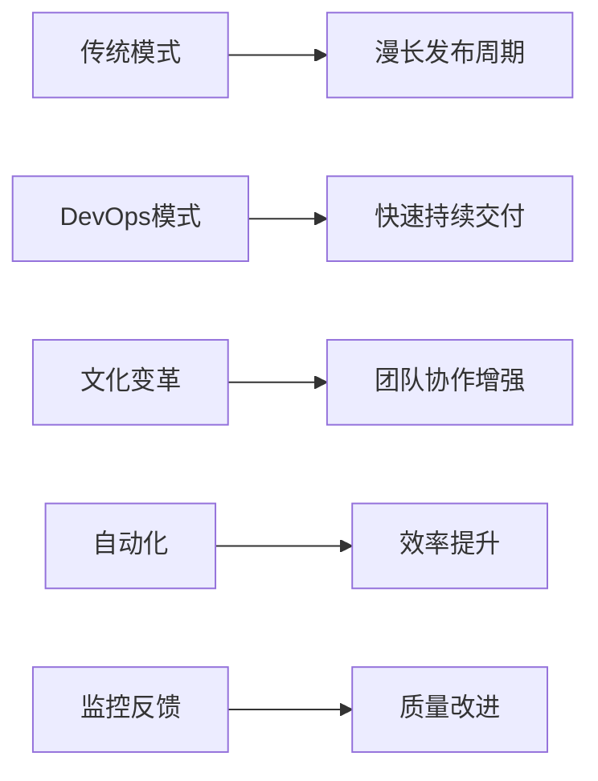
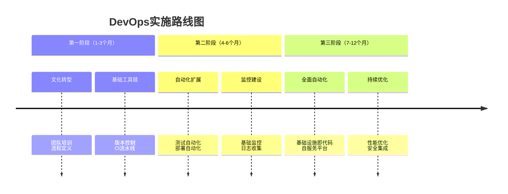

# DevOps实践指南

DevOps是一种融合软件开发（Development）和IT运维（Operations）的文化、实践和工具的组合，旨在缩短系统开发生命周期，提供高质量的持续交付。在现代软件工程中，DevOps已经成为提升团队效率和产品质量的关键方法论。

## 什么是DevOps？

### 核心理念
DevOps不仅仅是工具或流程，更是一种文化变革，它强调：
- **协作文化**：打破开发和运维之间的壁垒
- **自动化优先**：尽可能自动化重复性工作
- **持续改进**：通过度量和反馈不断优化流程
- **客户中心**：快速响应业务需求和用户反馈

### 效益与价值


## DevOps工具链全景图

### 完整工具生态系统
```yaml
devops_toolchain:
  planning:
    - jira
    - trello
    - asana

  coding:
    - git
    - github
    - gitlab

  building:
    - jenkins
    - gitlab-ci
    - github-actions

  testing:
    - selenium
    - jmeter
    - postman

  deployment:
    - ansible
    - terraform
    - kubernetes

  monitoring:
    - prometheus
    - grafana
    - elk-stack

  collaboration:
    - slack
    - teams
    - confluence
```

## CI/CD流水线实战

### Jenkins流水线示例
```groovy
pipeline {
    agent any
  
    environment {
        DOCKER_REGISTRY = 'registry.example.com'
        PROJECT_NAME = 'my-app'
        VERSION = '1.0.0'
    }
  
    stages {
        stage('代码检出') {
            steps {
                git branch: 'main', 
                url: 'https://github.com/your-repo/my-app.git'
            }
        }
      
        stage('代码质量检查') {
            steps {
                sh 'mvn checkstyle:checkstyle'
                sh 'mvn spotbugs:check'
            }
        }
      
        stage('单元测试') {
            steps {
                sh 'mvn test'
            }
            post {
                always {
                    junit 'target/surefire-reports/*.xml'
                }
            }
        }
      
        stage('构建镜像') {
            steps {
                script {
                    docker.build("${DOCKER_REGISTRY}/${PROJECT_NAME}:${VERSION}")
                }
            }
        }
      
        stage('安全扫描') {
            steps {
                sh 'trivy image ${DOCKER_REGISTRY}/${PROJECT_NAME}:${VERSION}'
            }
        }
      
        stage('部署到测试环境') {
            steps {
                sh 'kubectl apply -f k8s/test-deployment.yaml'
            }
        }
      
        stage('集成测试') {
            steps {
                sh 'mvn verify -Denvironment=test'
            }
        }
      
        stage('部署到生产环境') {
            when {
                branch 'main'
            }
            steps {
                sh 'kubectl apply -f k8s/prod-deployment.yaml'
            }
        }
    }
  
    post {
        failure {
            slackSend channel: '#build-alerts',
            message: "构建失败: ${currentBuild.fullDisplayName}"
        }
        success {
            slackSend channel: '#build-success',
            message: "构建成功: ${currentBuild.fullDisplayName}"
        }
    }
}
```

## 基础设施即代码（IaC）

### Terraform配置示例
```hcl
# providers.tf
terraform {
  required_version = ">= 1.0"
  required_providers {
    aws = {
      source  = "hashicorp/aws"
      version = "~> 4.0"
    }
  }
}

provider "aws" {
  region = "us-west-2"
}

# network.tf
resource "aws_vpc" "main" {
  cidr_block = "10.0.0.0/16"

  tags = {
    Name = "main-vpc"
    Environment = "production"
  }
}

resource "aws_subnet" "public" {
  count = 2
  vpc_id = aws_vpc.main.id
  cidr_block = "10.0.${count.index}.0/24"
  availability_zone = "us-west-2${count.index == 0 ? "a" : "b"}"

  tags = {
    Name = "public-subnet-${count.index + 1}"
  }
}

# compute.tf
resource "aws_instance" "web" {
  count = 2
  ami = "ami-0c55b159cbfafe1f0"
  instance_type = "t3.micro"
  subnet_id = aws_subnet.public[count.index].id

  tags = {
    Name = "web-server-${count.index + 1}"
  }
}

# output.tf
output "web_instance_ips" {
  value = aws_instance.web[*].public_ip
}

output "vpc_id" {
  value = aws_vpc.main.id
}
```

## 容器化与编排

### Dockerfile最佳实践
```dockerfile
# 多阶段构建示例
FROM node:18-alpine AS builder

WORKDIR /app
COPY package*.json ./
RUN npm ci --only=production

FROM node:18-alpine AS runtime

WORKDIR /app
COPY --from=builder /app/node_modules ./node_modules
COPY . .

# 安全增强
RUN addgroup -g 1001 -S nodejs && \
    adduser -S nodejs -u 1001 && \
    chown -R nodejs:nodejs /app

USER nodejs

# 健康检查
HEALTHCHECK --interval=30s --timeout=3s \
  CMD curl -f http://localhost:3000/health || exit 1

EXPOSE 3000
CMD ["node", "server.js"]
```

### Kubernetes部署配置
```yaml
# deployment.yaml
apiVersion: apps/v1
kind: Deployment
metadata:
  name: web-app
  labels:
    app: web-app
spec:
  replicas: 3
  selector:
    matchLabels:
      app: web-app
  template:
    metadata:
      labels:
        app: web-app
    spec:
      containers:
      - name: web-app
        image: registry.example.com/web-app:1.0.0
        ports:
        - containerPort: 3000
        resources:
          requests:
            memory: "256Mi"
            cpu: "250m"
          limits:
            memory: "512Mi"
            cpu: "500m"
        livenessProbe:
          httpGet:
            path: /health
            port: 3000
          initialDelaySeconds: 30
          periodSeconds: 10
        readinessProbe:
          httpGet:
            path: /ready
            port: 3000
          initialDelaySeconds: 5
          periodSeconds: 5
---
# service.yaml
apiVersion: v1
kind: Service
metadata:
  name: web-app-service
spec:
  selector:
    app: web-app
  ports:
  - port: 80
    targetPort: 3000
  type: LoadBalancer
```

## 监控与可观测性

### Prometheus配置示例
```yaml
# prometheus.yml
global:
  scrape_interval: 15s
  evaluation_interval: 15s

alerting:
  alertmanagers:
  - static_configs:
    - targets: ['alertmanager:9093']

rule_files:
  - 'alert.rules.yml'

scrape_configs:
  - job_name: 'kubernetes-pods'
    kubernetes_sd_configs:
    - role: pod
    relabel_configs:
    - source_labels: [__meta_kubernetes_pod_annotation_prometheus_io_scrape]
      action: keep
      regex: true
    - source_labels: [__meta_kubernetes_pod_annotation_prometheus_io_path]
      action: replace
      target_label: __metrics_path__
      regex: (.+)
    - source_labels: [__address__, __meta_kubernetes_pod_annotation_prometheus_io_port]
      action: replace
      regex: ([^:]+)(?::\d+)?;(\d+)
      replacement: $1:$2
      target_label: __address__

  - job_name: 'node-exporter'
    static_configs:
    - targets: ['node-exporter:9100']
```

### Grafana仪表板配置
```json
{
  "dashboard": {
    "title": "应用性能监控",
    "panels": [
      {
        "title": "CPU使用率",
        "type": "graph",
        "targets": [
          {
            "expr": "rate(container_cpu_usage_seconds_total{container_name=~'.+'}[5m])",
            "legendFormat": "{{container_name}}"
          }
        ]
      },
      {
        "title": "内存使用",
        "type": "graph",
        "targets": [
          {
            "expr": "container_memory_usage_bytes{container_name=~'.+'}"
          }
        ]
      }
    ]
  }
}
```

## 安全DevOps（DevSecOps）

### 安全扫描流水线
```bash
#!/bin/bash
# security-scan.sh

# 依赖检查
echo "检查依赖漏洞..."
npm audit --production
pip-audit

# 容器安全扫描
echo "扫描容器镜像..."
trivy image ${IMAGE_NAME}:${VERSION}

# 基础设施安全扫描
echo "扫描Terraform配置..."
tfsec .

# 代码安全扫描
echo "静态代码分析..."
bandit -r .
gosec ./...

# 依赖许可证检查
echo "许可证合规检查..."
license-checker --summary
```

## 灾难恢复与备份

### 备份策略配置
```yaml
backup_strategy:
  databases:
    schedule: "0 2 * * *"  # 每天凌晨2点
    retention: 30 days
    encryption: true

  configurations:
    schedule: "0 3 * * *"
    retention: 90 days
    include:
      - kubernetes-configs
      - terraform-state
      - application-configs

  monitoring:
    enabled: true
    alert_on_failure: true
    notification_channels:
      - email
      - slack
```

## 团队协作与文档

### 文档即代码实践
```markdown
# 项目文档结构
docs/
├── architecture/          # 架构设计
│   ├── system-design.md
│   └── data-flow.md
├── deployment/           # 部署指南
│   ├── local-setup.md
│   └── production.md
├── operations/          # 运维手册
│   ├── monitoring.md
│   └── troubleshooting.md
└── api/                 # API文档
    ├── rest-api.md
    └── graphql-api.md

# 使用工具
- MkDocs或Docusaurus生成静态站点
- Swagger/OpenAPI用于API文档
- PlantUML用于架构图
```

## 性能优化策略

### 流水线优化技巧
```bash
# 并行执行任务
parallel:
  - stage: "单元测试"
    command: "mvn test"
  - stage: "代码质量"
    command: "mvn checkstyle:checkstyle"
  - stage: "安全扫描"
    command: "trivy config ."

# 缓存依赖
cache:
  paths:
    - ~/.m2/repository
    - node_modules
    - .terraform

# 增量构建
only:
  changes:
    - "src/**/*"
    - "pom.xml"
    - "package.json"
```

## 成本优化与管理

### 云资源成本控制
```yaml
cost_optimization:
  compute:
    use_spot_instances: true
    right_size_instances: true
    auto_scaling:
      enabled: true
      min_replicas: 2
      max_replicas: 10

  storage:
    use_lifecycle_policies: true
    enable_compression: true
    delete_old_backups: true

  monitoring:
    budget_alerts:
      enabled: true
      thresholds: [80%, 90%, 100%]
    cost_anomaly_detection: true
```

## 实施路线图

### 分阶段实施计划


## 成功度量指标

### 关键绩效指标
```python
# 指标计算示例
def calculate_dora_metrics(deployments, incidents, changes):
    """计算DORA四大关键指标"""
    metrics = {}
  
    # 部署频率
    metrics['deployment_frequency'] = len(deployments) / 30  # 按天计算
  
    # 变更前置时间
    lead_times = [d.deploy_time - d.commit_time for d in deployments]
    metrics['lead_time'] = sum(lead_times) / len(lead_times)
  
    # 变更失败率
    metrics['change_failure_rate'] = len(incidents) / len(changes)
  
    # 平均恢复时间
    recovery_times = [i.recovery_time - i.occurrence_time for i in incidents]
    metrics['recovery_time'] = sum(recovery_times) / len(recovery_times)
  
    return metrics
```

## 常见问题解决

### 故障排除指南
```markdown
## 常见问题及解决方案

### 流水线执行缓慢
- **原因**: 依赖下载慢或测试用例过多
- **解决方案**: 
  - 设置镜像仓库缓存
  - 并行执行测试用例
  - 使用更强大的执行器

### 部署失败
- **原因**: 配置错误或资源不足
- **解决方案**:
  - 增加部署前检查
  - 实施蓝绿部署
  - 完善回滚机制

### 监控告警频繁
- **原因**: 阈值设置不合理或系统负载高
- **解决方案**:
  - 调整告警阈值
  - 优化系统性能
  - 实施告警收敛
```

## 资源与进一步学习

### 推荐学习路径
```yaml
learning_path:
  beginner:
    - "DevOps文化与实践"
    - "Linux系统基础"
    - "网络基础知识"

  intermediate:
    - "容器技术深入"
    - "云原生架构"
    - "自动化工具链"

  advanced:
    - "SRE实践"
    - "混沌工程"
    - "性能工程"
```

### 社区与资源
- **会议**: DevOpsDays, KubeCon
- **论坛**: DevOps Reddit, Stack Overflow
- **博客**: Google SRE Blog, AWS DevOps Blog
- **认证**: AWS DevOps Engineer, Kubernetes认证

---

**最后更新**: 2023-10-28
**作者**: DevOps实践指南团队
**更多资源**: [DevOps资源中心](https://example.com/devops-resources)

> 成功实施DevOps需要技术、流程和文化的完美结合。开始小规模实践，持续度量改进，逐步扩展到整个组织。