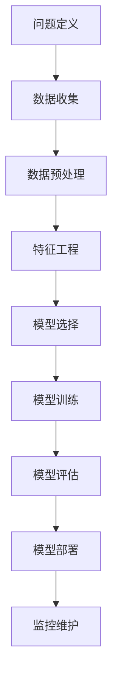

# 机器学习入门与实践

机器学习是人工智能的核心领域，它使计算机能够从数据中学习并做出预测或决策，而无需显式编程。随着大数据和计算能力的发展，机器学习正在改变各行各业，从医疗诊断到推荐系统，无处不在。本文将带你系统了解机器学习的基础知识并开始实践。

## 什么是机器学习？

### 基本定义
机器学习是一门多领域交叉学科，专门研究计算机如何模拟或实现人类的学习行为，以获取新的知识或技能，重新组织已有的知识结构使之不断改善自身的性能。

### 机器学习的重要性
- **自动化决策**：处理人类无法手动分析的海量数据
- **模式发现**：从数据中发现隐藏的规律和洞察
- **预测能力**：基于历史数据预测未来趋势
- **个性化服务**：提供定制化的用户体验

## 机器学习类型

### 监督学习（Supervised Learning）
使用标注数据训练模型，用于预测或分类
- **回归问题**：预测连续值（如房价预测）
- **分类问题**：预测离散类别（如垃圾邮件识别）

### 无监督学习（Unsupervised Learning）
使用未标注数据发现隐藏模式
- **聚类分析**：将数据分组（如客户细分）
- **降维**：减少特征数量（如PCA）

### 强化学习（Reinforcement Learning）
通过试错学习最优策略
- 应用场景：游戏AI、机器人控制

## 机器学习工作流程

### 完整项目流程


## 环境设置与工具准备

### Python库安装
```bash
# 创建conda环境（推荐）
conda create -n ml-env python=3.9
conda activate ml-env

# 安装核心机器学习库
pip install numpy pandas matplotlib seaborn
pip install scikit-learn tensorflow keras
pip install jupyter notebook

# 安装其他实用工具
pip install scipy statsmodels xgboost lightgbm
```

### 开发环境配置
```python
# 常用的导入语句
import numpy as np
import pandas as pd
import matplotlib.pyplot as plt
import seaborn as sns
from sklearn.model_selection import train_test_split
from sklearn.metrics import accuracy_score, classification_report

# 设置绘图样式
plt.style.use('seaborn-v0_8')
sns.set_palette("husl")
%matplotlib inline
```

## 实战案例：鸢尾花分类

### 数据集介绍
鸢尾花数据集包含150个样本，每个样本有4个特征：
- 花萼长度（sepal length）
- 花萼宽度（sepal width）
- 花瓣长度（petal length）
- 花瓣宽度（petal width）

目标变量为3种鸢尾花类别：
- Setosa
- Versicolor
- Virginica

### 完整代码示例
```python
# 导入必要的库
from sklearn.datasets import load_iris
from sklearn.model_selection import train_test_split
from sklearn.preprocessing import StandardScaler
from sklearn.ensemble import RandomForestClassifier
from sklearn.metrics import accuracy_score, confusion_matrix
import matplotlib.pyplot as plt
import seaborn as sns

# 加载数据
iris = load_iris()
X = iris.data
y = iris.target

# 数据探索
print("数据集形状:", X.shape)
print("特征名称:", iris.feature_names)
print("目标类别:", iris.target_names)
print("样本分布:\n", pd.Series(y).value_counts())

# 数据预处理
scaler = StandardScaler()
X_scaled = scaler.fit_transform(X)

# 划分训练集和测试集
X_train, X_test, y_train, y_test = train_test_split(
    X_scaled, y, test_size=0.2, random_state=42, stratify=y
)

# 创建和训练模型
model = RandomForestClassifier(n_estimators=100, random_state=42)
model.fit(X_train, y_train)

# 预测和评估
y_pred = model.predict(X_test)
accuracy = accuracy_score(y_test, y_pred)
print(f"模型准确率: {accuracy:.4f}")

# 可视化混淆矩阵
plt.figure(figsize=(8, 6))
cm = confusion_matrix(y_test, y_pred)
sns.heatmap(cm, annot=True, fmt='d', cmap='Blues', 
            xticklabels=iris.target_names, 
            yticklabels=iris.target_names)
plt.title('混淆矩阵')
plt.ylabel('真实标签')
plt.xlabel('预测标签')
plt.show()

# 特征重要性分析
feature_importance = model.feature_importances_
plt.figure(figsize=(10, 6))
sns.barplot(x=feature_importance, y=iris.feature_names)
plt.title('特征重要性')
plt.xlabel('重要性得分')
plt.tight_layout()
plt.show()
```

## 常用机器学习算法

### 分类算法比较
| 算法         | 优点               | 缺点             | 适用场景     |
| ------------ | ------------------ | ---------------- | ------------ |
| **逻辑回归** | 简单、可解释性强   | 只能处理线性问题 | 二分类问题   |
| **决策树**   | 直观、无需特征缩放 | 容易过拟合       | 分类和回归   |
| **随机森林** | 抗过拟合、高准确率 | 计算成本高       | 复杂分类问题 |
| **SVM**      | 在高维空间有效     | 对参数敏感       | 小数据集分类 |
| **神经网络** | 表达能力极强       | 需要大量数据     | 复杂模式识别 |

### 回归算法选择指南
```python
# 回归算法性能比较函数
def compare_regression_models(X, y):
    from sklearn.model_selection import cross_val_score
    from sklearn.linear_model import LinearRegression, Ridge, Lasso
    from sklearn.ensemble import RandomForestRegressor, GradientBoostingRegressor
    from sklearn.svm import SVR
  
    models = {
        'Linear Regression': LinearRegression(),
        'Ridge Regression': Ridge(),
        'Lasso Regression': Lasso(),
        'Random Forest': RandomForestRegressor(),
        'Gradient Boosting': GradientBoostingRegressor(),
        'SVR': SVR()
    }
  
    results = {}
    for name, model in models.items():
        scores = cross_val_score(model, X, y, cv=5, scoring='r2')
        results[name] = scores.mean()
  
    return results
```

## 模型评估与优化

### 评估指标
```python
# 分类评估指标计算
def evaluate_classification(y_true, y_pred, y_prob=None):
    from sklearn.metrics import (accuracy_score, precision_score, 
                               recall_score, f1_score, roc_auc_score,
                               confusion_matrix, classification_report)
  
    metrics = {
        'Accuracy': accuracy_score(y_true, y_pred),
        'Precision': precision_score(y_true, y_pred, average='weighted'),
        'Recall': recall_score(y_true, y_pred, average='weighted'),
        'F1-Score': f1_score(y_true, y_pred, average='weighted')
    }
  
    if y_prob is not None and len(np.unique(y_true)) == 2:
        metrics['AUC-ROC'] = roc_auc_score(y_true, y_prob)
  
    print("分类报告:")
    print(classification_report(y_true, y_pred))
  
    return metrics
```

### 超参数调优
```python
# 使用GridSearch进行参数优化
from sklearn.model_selection import GridSearchCV

def optimize_parameters(model, param_grid, X, y):
    grid_search = GridSearchCV(
        estimator=model,
        param_grid=param_grid,
        scoring='accuracy',
        cv=5,
        n_jobs=-1,
        verbose=1
    )
  
    grid_search.fit(X, y)
  
    print("最佳参数:", grid_search.best_params_)
    print("最佳得分:", grid_search.best_score_)
  
    return grid_search.best_estimator_
```

## 实践项目建议

### 入门项目清单
1. **泰坦尼克生存预测**
   - 二分类问题
   - 数据来源：Kaggle Titanic数据集
   - 技术点：数据清洗、特征工程、分类算法

2. **房价预测**
   - 回归问题
   - 数据来源：Kaggle House Prices
   - 技术点：数值预测、特征选择、回归算法

3. **手写数字识别**
   - 多分类问题
   - 数据来源：MNIST数据集
   - 技术点：图像处理、神经网络

### 项目结构模板
```bash
project-name/
├── data/
│   ├── raw/          # 原始数据
│   ├── processed/    # 处理后的数据
│   └── external/     # 外部数据
├── notebooks/        # Jupyter笔记本
├── src/             # 源代码
│   ├── data_processing.py
│   ├── feature_engineering.py
│   ├── modeling.py
│   └── evaluation.py
├── models/          # 训练好的模型
├── requirements.txt # 依赖包
└── README.md        # 项目说明
```

## 学习资源推荐

### 在线课程
- **Coursera**：Andrew Ng的机器学习课程
- **edX**：Microsoft的机器学习基础
- **Fast.ai**：实践导向的深度学习课程

### 书籍推荐
- 《Python机器学习实战》
- 《统计学习方法》
- 《深度学习》

### 实践平台
- **Kaggle**：数据科学竞赛平台
- **Colab**：免费的GPU计算环境
- **GitHub**：开源项目学习

## 常见问题与解决方案

### 数据质量问题
```python
# 数据质量检查函数
def check_data_quality(df):
    quality_report = {
        'missing_values': df.isnull().sum(),
        'duplicate_rows': df.duplicated().sum(),
        'data_types': df.dtypes,
        'numeric_stats': df.describe() if df.select_dtypes(include=[np.number]).shape[1] > 0 else None,
        'categorical_stats': df.select_dtypes(include=['object']).describe() if df.select_dtypes(include=['object']).shape[1] > 0 else None
    }
    return quality_report
```

### 过拟合处理策略
1. **增加数据量**：收集更多训练数据
2. **特征选择**：移除不相关特征
3. **正则化**：添加L1/L2正则项
4. **交叉验证**：使用k折交叉验证
5. **早停**：监控验证集性能

## 进阶学习路径

### 技术栈发展
```yaml
基础阶段:
  - Python编程
  - 统计学基础
  - 机器学习算法

进阶阶段:
  - 深度学习
  - 自然语言处理
  - 计算机视觉

专业阶段:
  - 强化学习
  - 生成式AI
  - 大模型应用
```

### 认证与职业发展
- **专业认证**：AWS机器学习认证、Google云机器学习工程师
- **职业路径**：机器学习工程师、数据科学家、AI研究员
- **社区参与**：参加技术会议、贡献开源项目

## 结语

机器学习是一个充满挑战和机遇的领域。通过本文的学习，你应该已经掌握了机器学习的基础知识并能够开始实践。记住，最好的学习方式就是动手做项目，在实践中遇到问题并解决问题。

**下一步行动建议**：
1. 完成鸢尾花分类案例
2. 在Kaggle上找一个入门比赛
3. 构建自己的第一个机器学习项目
4. 加入机器学习社区交流学习

祝你机器学习之旅顺利！如果有任何问题，欢迎在讨论区交流。

---
*本文最后更新于: 2023-10-25*
*作者: 机器学习助手*
*更多资源请访问 [机器学习学习中心](https://example.com/ml-resources)*